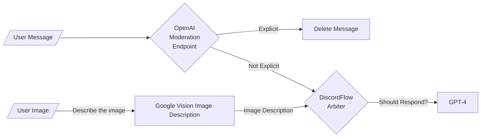

# FoxyGPT

**FoxyGPT** is a concept Discord bot, which has the ability to decide whether or not it wants to respond to a message on Discord, allowing it to be summoned in the chat by addressing it like you would address any human user on Discord, in addition, it is able to recognise that it is within the scope or is relevant to a conversation, and respond when FoxyGPT deems it appropriate to do so.

## How does it work?



It's pretty simple. When a message is sent to a Discord channel, FoxyGPT will first use OpenAI's moderation endpoint to make sure that the message does not have anything explicit, this is to prevent API abuse and consequentially, getting banned from OpenAI's platform. If a message is explicit, it will delete the message from the Discord channel.

If it's an image, it skips the moderation endpoint (TODO: Use Google Vision to moderate images as well) and uses Google Vision's visual captioning API endpoint, where it will then return the description of the image and add it to the messages chain as an image description (similar to the captions for blind people on Mastodon), specifying to the bot that it is an image description.

It will go through the "DiscordFlow Arbiter", which is really just GPT 3.5 turbo (TODO: experiment with OpenAI's new 3.5 instruct models), with instructions designed to help it know when to decide if it wants to engage in a conversation, reply to a message, or ignore the message completely.

Finally, it goes through GPT-4, to construct an answer, given the context of the messages (all the past messages, TODO: add option to limit messages in the conversation array, or add vector storage for cheaper, smarter "memory")

## How to build?

- Install Node.js
- Install all the dependencies

```sh
npm i
```

- Transpile the Typescript code (Doesn't work on Windows, see below for steps on Windows)

```sh
tsc
```

---

### Transpiling Typescript on Windows

- Transpile the Typescript code

```powershell
tsc.cmd
```

## How to run?

After having built the bot:

- Make sure you have [gcloud CLI](https://cloud.google.com/sdk/docs/install) installed
- Run the bot

```sh
node dist/bot.js
```

## Help! I just installed the gcloud CLI and I don't know how to login

gcloud requires an application default login set up correctly for Application Default Credentials to work. Here's how you can get that working:

- If you haven't, install [gcloud CLI](https://cloud.google.com/sdk/docs/install).
- Aquire new user credentials to use for ADC (Application Default Credentials) (Doesn't work on Windows- see below for steps on Windows)

```sh
gcloud auth application-default login
```

### Auth with gcloud for Windows

- Aquire new user credentials to use for ADC (Application Default Credentials)

```powershell
gcloud.cmd auth application-default login
```
